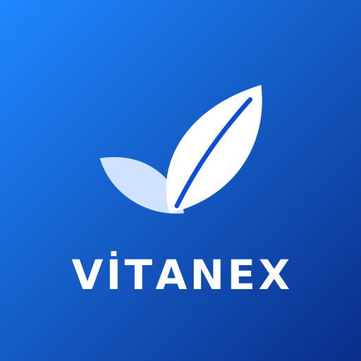
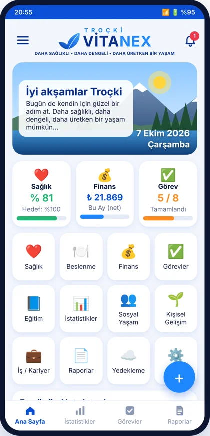
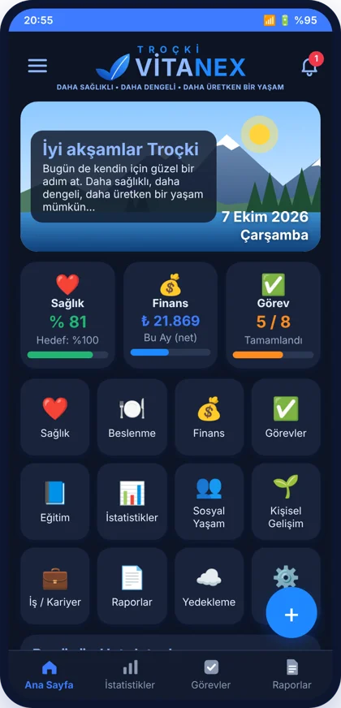

<p align="center">
  
</p>

<h1 align="center">TROÇKİ VİTANEX</h1>
<p align="center"><b>Kişisel Yaşam Yönetim Sistemi — Hayatını Sen Yönet</b><br/>
Daha sağlıklı • Daha dengeli • Daha üretken bir yaşam</p>

<p align="center">
  
  &nbsp;&nbsp;
  
</p>

Sağlık, beslenme, finans, görevler, eğitim, kişisel gelişim, sosyal yaşam ve kariyer — hepsi tek uygulamada.
Kayıtlar grafiklere ve raporlara dönüşür; **tüm veriler yalnızca cihazınızda** saklanır.

## ⬇️ İndir / Kullan

| Platform | Nasıl |
|---|---|
| **Android** | [**⬇ TROCKI_VITANEX.apk indir**](https://github.com/trocki59-byte/TROCKI-VITANEX/releases/latest/download/TROCKI_VITANEX.apk) — ya da [Releases](https://github.com/trocki59-byte/TROCKI-VITANEX/releases/latest) sayfası |
| **iPhone** | [**https://trocki59-byte.github.io/TROCKI-VITANEX/**](https://trocki59-byte.github.io/TROCKI-VITANEX/) adresini **Safari** ile açın → **Paylaş ⬆︎ → Ana Ekrana Ekle** |
| **Web / Bilgisayar** | [**Tarayıcıda aç**](https://trocki59-byte.github.io/TROCKI-VITANEX/) — kurulum gerekmez |

## ✨ Özellikler

- ❤️ **Sağlık:** kilo, tansiyon, nabız, SpO₂, uyku, egzersiz, su takibi, ilaçlar ve ilaç hatırlatıcıları
- 🍽️ **Beslenme:** öğünler, kalori, günlük/haftalık takip
- 💰 **Finans:** gelir–gider, kategoriler, aylık net durum, tasarruf oranı
- ✅ **Görevler:** öncelik, durum (Bekliyor / Devam / Tamamlandı), tarih–saat
- 📘 Eğitim · 🌱 Kişisel Gelişim · 👥 Sosyal Yaşam · 💼 İş / Kariyer
- 📊 **İstatistikler:** günlük / haftalık / aylık / yıllık grafikler
- 📄 **Raporlar:** PDF olarak kaydet, paylaş, yazdır
- ☁️ **Yedekleme** ve geri yükleme
- 🌙 Açık / koyu tema · 📱 telefon ve tablet uyumlu

## 🧩 Proje yapısı

```
VITANEX.sln              Visual Studio çözümü
VITANEX/                 Android uygulaması (C# · .NET 10 MAUI · SQLite)
web/                     iPhone / Web sürümü (tek HTML + PWA)
docs/                    Ekran görüntüleri
.github/workflows/       Otomatik APK derleme ve web yayını
APK_OLUSTUR.bat          Bilgisayarda tek tıkla APK
```

## 🛠️ Kendin derle

1. Visual Studio 2026 (.NET MAUI iş yükü ile) kurulu olsun.
2. `VITANEX.sln` dosyasını açın, Android cihaz/emülatör seçip ▶ ile çalıştırın.
3. APK için `APK_OLUSTUR.bat` dosyasına çift tıklayın.

Her `main` güncellemesinde GitHub Actions APK'yı otomatik derler (**Actions → Android APK → Artifacts**).
`v1.0` gibi bir etiket atıldığında APK **Releases** sayfasında yayımlanır.

---

<p align="center"><b>TROÇKİ</b> tarafından geliştirildi · <a href="https://trocki22.com.tr">trocki22.com.tr</a><br/>
<i>Düşün • Keşfet • Üret • Paylaş</i></p>
